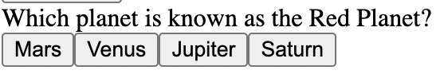
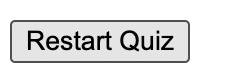

# Online Quiz (Javascript Project)

## Project Overview

Welcome to the Online Quiz, an engaging web application designed to test your general knowledge across various subjects. Users can enjoy a challenging quiz experience while tracking their scores, making it both entertaining and educational.

## Table of Contents

1. [Features](#features)
2. [User Experience (UX)](#user-experience-ux)
    - [User Stories](#user-stories)
    - [Design](#design)
3. [Technologies Used](#technologies-used)
4. [Testing](#testing)
5. [Deployment](#deployment)
6. [Credits](#credits)
7. [Acknowledgements](#acknowledgements)

## Features

- **Score Tracking**: Keeps track of the user’s score throughout the quiz.

- **Questions with Multiple Choices**: Each question offers four possible answers.

- **Feedback on Answers**: Immediate feedback on whether the selected answer is correct or incorrect through sound effects.
- **Final Score Display**: Shows the user’s score at the end of the quiz.

- **Restart Quiz Option**: Allows users to retake the quiz.

## User Experience (UX)

### User Stories

- **As a user,** I want to start the quiz easily from the homepage.
- **As a user,** I want to receive immediate feedback on my answers.
- **As a user,** I want to see my final score at the end of the quiz.
- **As a user,** I want to have the option to restart the quiz.

### Design

- **Logo**: A vibrant and engaging logo to be recognisable to users.
- **Typography**: Clear and readable fonts.
- **Layout**: Intuitive layout with clear navigation and responsive design for various devices.

## Technologies Used

- **HTML5**: For the structure of the web pages.
- **CSS3**: For styling the web pages.
- **JavaScript**: For interactive elements and quiz functionality.
- **Git & GitHub**: For version control and project deployment.

## Testing

- **HTML Validation**: Passed through the W3C Markup Validation Service.
- **CSS Validation**: Passed through the W3C CSS Validation Service (Jigsaw).
- **JavaScript Linting**: Passed through JSHint with no significant issues.
- **Responsiveness**: Tested on various devices and screen sizes to ensure responsive design.
- **Browser Compatibility**: Tested on multiple browsers, including Chrome, Firefox, Safari, and Edge.

## Deployment

The project is deployed on GitHub Pages:

1. **Clone the Repository**: `git clone https://github.com/nanaantwii/JavaScript-Project`
2. **Navigate to the Repository**: `cd JavaScript-Project`
3. **Open `index.html` in Your Browser**.

To deploy on GitHub Pages:

1. Push the code to the `main` branch of your repository.
2. In the repository settings, navigate to the "Pages" section.
3. Select the `main` branch as the source and save.

The live link to the project: [Online Quiz](https://nanaantwii.github.io/JavaScript-Project/)

## Credits

### Content

- Questions sourced from general knowledge databases and trivia sites.

### Media

- **Sounds**: Sourced from [Pixabay](https://pixabay.com/).
- **Logo**: Created using [Canva](https://www.canva.com/).

### Code

- The project structure and some code snippets were inspired by tutorials from [Code Institute](https://codeinstitute.net/).

## Acknowledgements

I would like to thank my mentors and the community at Code Institute for their guidance and support throughout the development of this project.
